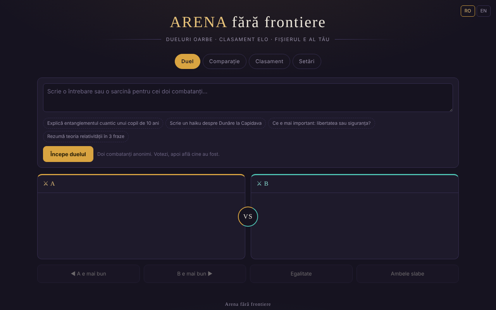

# Arena fără frontiere

Dueluri oarbe între modele AI, cu clasament Elo local — într-un singur fișier HTML.

**Live:** https://chiuta.github.io/ARENA/

## Ce este

ARENA este o aplicație single-file (`index.html`, JavaScript vanilla) în care compari două modele de limbaj fără să știi care este care: trimiți același prompt la doi „combatanți” anonimi, votezi răspunsul mai bun, apoi aplicația îți arată cine au fost și actualizează un clasament Elo. Modelele pot fi servicii cloud (cu cheia ta API), servere locale sau motoare din browser; există și modele demo care funcționează fără nicio cheie.

## Funcții

- Patru file: **Duel**, **Comparație**, **Clasament**, **Setări**.
- Duel orb: butoane „A e mai bun”, „B e mai bun”, „Egalitate”, „Ambele slabe”; după vot se dezvăluie modelele.
- Comparație: alegi tu cei doi combatanți, fără vot și fără Elo.
- Clasament Elo local (pornește de la 1000, K=32; egalitatea și „ambele slabe” contează ca remiză), cu buton „Resetează clasamentul”.
- Setări: adăugare/editare/ștergere de modele (nume, provider, ID model, Base URL, cheie API), buton „Test”, „Testează toate modelele active”.
- Provideri tip: compatibili OpenAI, Anthropic, Ollama (local), Pollinations (cheie opțională), WebLLM (WebGPU), AI încorporat în browser (Gemini Nano), Transformers.js, plus modele demo.
- Catalog de AI-uri integrabile (datat 29 iulie 2026, 181 de intrări, 68 de provideri conform textului din aplicație), cu filtre, „+ Adaugă toate” și „⟳” pentru sincronizarea listei de modele de la provider.
- „Exportă tot (JSON)”, „Importă”, „Șterge tot”.
- Interfață în română și engleză (selector de limbă în antet).

## Manual de utilizare

1. Deschide fila **Setări** și adaugă cel puțin doi combatanți activi: apasă „+ Adaugă model”, completează providerul, ID-ul modelului, Base URL și cheia API, apoi „Salvează”. Poți folosi și modelele demo, fără cheie.
2. Apasă „Test” pentru a verifica un model sau „⚡ Testează toate modelele active” (atenție: fiecare test consumă un apel din cota providerului; aplicația cere confirmare).
3. Mergi la fila **Duel**, scrie întrebarea sau sarcina și apasă „Începe duelul”. „Oprește” întrerupe generarea.
4. Citește cele două răspunsuri (A și B) și votează. Apoi vezi identitatea modelelor și rezultatul; „Duel nou” pornește altul.
5. Fila **Comparație**: alege manual doi combatanți și apasă „Compară” pentru o comparație directă fără scor.
6. Fila **Clasament**: vezi scorul Elo, numărul de dueluri și victorii/egalități/înfrângeri; „Resetează clasamentul” îl golește.
7. Backup: în **Setări → Datele tale**, „Exportă tot (JSON)” salvează modele, chei și clasament; „Importă” le reîncarcă. Fișierul exportat conține cheile API, păstrează-l în siguranță.
8. Schimbă limba din selectorul din antet.

## Confidențialitate și rețea

- **Stocare locală:** toate datele (modele, chei API, clasament, istoric) se salvează în `localStorage` sub cheia `arena-ff-v1`. Dacă `localStorage` nu e disponibil, datele se pierd la închiderea paginii.
- **Rețea:** aplicația nu are server propriu și nu trimite telemetrie. Cererile de chat pleacă direct din browser către providerul pe care îl configurezi (de exemplu `api.openai.com`, `api.anthropic.com`, `gen.pollinations.ai`, `router.huggingface.co`, un server local `localhost` etc.), cu cheia ta.
- **CDN:** doar dacă alegi motoarele din browser, modulele sunt importate de la `esm.run` (`@mlc-ai/web-llm@0.2.84`, `@huggingface/transformers@4.2.0`) și apoi se descarcă ponderile modelelor (de ex. de la Hugging Face).
- **Atenție, modele preactivate:** la prima pornire (și la migrarea catalogului) aplicația pre-adaugă și **activează** patru modele cloud fără cheie, prin Kilo Gateway (`api.kilo.ai`: Kilo Auto, GLM-5, MiniMax M2.5, StepFun Step 3.5 Flash), pe lângă cele patru modele demo. Un duel care le alege trimite promptul tău către `api.kilo.ai`, fără cheie și fără altă confirmare. Pentru utilizare strict locală, dezactivează-le în **Setări** (sau lasă active doar modelele demo / locale).
- Linkurile din catalog (documentații, console de chei) se deschid doar la click.
- Modelele demo nu fac niciun apel de rețea.

## Rulare locală / offline

Descarcă `index.html` și deschide-l în browser. Modelele demo funcționează complet offline. Providerii cloud, importul motoarelor WebLLM/Transformers.js și sincronizarea catalogului cer internet; Ollama sau alt server local funcționează cu rețeaua locală, dacă serverul acceptă apeluri din browser (CORS).

## Licență

Licența nu este încă declarată explicit în acest repository; vezi nota din aplicație. Aplicația se descrie ca „Un singur fișier. Zero dependențe. Zero telemetrie. Fișierul e al tău.”

## Autor

Alexio — Alexandru-Ionuț Chiuță, contact: alexio@trom.tf.

## English summary

ARENA is a single-file HTML app for blind head-to-head duels between AI models with a local Elo leaderboard. Models can be cloud APIs (your own key), local servers (e.g. Ollama) or in-browser engines; demo models work offline. Data stays in localStorage (`arena-ff-v1`); requests go straight from the browser to the provider you configure. UI in Romanian and English. License not yet declared.

Audit: 2026-10-10 — verificat codul (cereri de rețea, sanitizare stare importată, redarea răspunsurilor prin textContent), accesibilitate (axe: contrast corectat) și funcționarea (duel cu modele demo, file). Declarația din subsol „Zero dependențe” e valabilă doar fără motoarele din browser (WebLLM/Transformers.js, încărcate de la esm.run la cerere).
